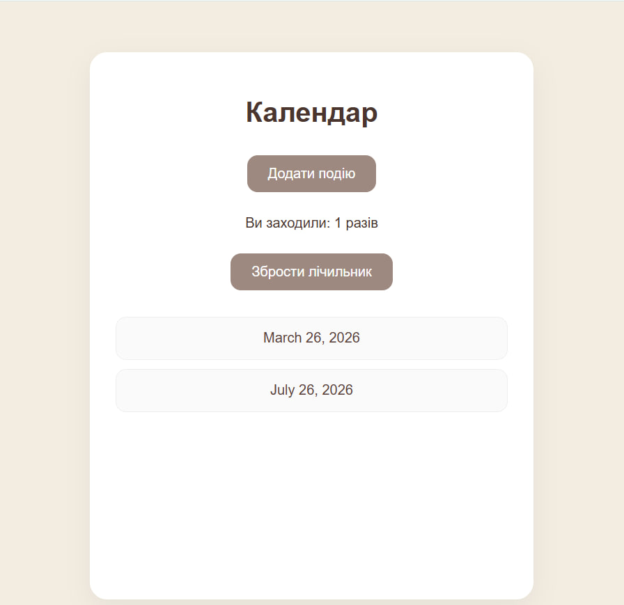

<div align="center">

# 📅 My Calendar Prоject  

Цей проєкт є частиною нашого **групового проєкту про школу**. 
Календар дозволяє зручно відстежувати події, переглядати список дат та додавати нові записи.
</div>

---

> ### 📑 Зміст
> - [🎐 Моделі](#models)
> - [✨ Вьюшки](#views)
> - [🎏 Кастомні форми](#forms)
> - [🎀 Темплейти](#templates)
> - [➡️ Встановлення](#install)
---

### <h3 id="models">🎐 Моделі</h3>
> В цьому блоці було реалізовано 3 моделі:
* `Event` — описує саму подію
* `CalendarDay` — представляє конкретний день у календарі з можливістю додавання нотаток
* `CalendarEvent` — пов'язує подію з конкретною датою (використовується зв'язок `ForeignKey`)

---
### <h3 id="views">✨ Вьюшки</h3>
> Для роботи застосунку використовуються функціональні вьюшки:
* Відображення головної сторінки календаря
* Перегляд списку подій на певну дату
* Логіка лічильника відвідувань користувача

---
### <h3 id="forms">🎏 Кастомні форми</h3>
> Для додавання подій зробили зручну форму. Вона сама перевіряє, чи правильно користувач заповнив поля, перш ніж зберегти запис.

---
### <h3 id="templates">🎀 Темплейти</h3>
> Календар має унікальний та приємний стиль:
* **Колірна гама:** інтерфейс оформлений у приємних "кавових" та коричневих тонах, що створює теплу атмосферу.
* **Стилізація кнопок:** основні кнопки та кнопки навігації оформлені в кастомні стилі, що змінюють колір при наведенні.
* **Адаптивність:** дизайн коректно відображається на пристроях різного розміру завдяки використанню медіа-запитів у СSS.

---
### <h3 id="install">➡️ Встановлення</h3>
> Для того, щоб проєкт працював коректно, необхідно встановити всі бібліотеки, зазначені у файлі `requirements.txt`.
> Для встановлення виконайте команду в терміналі:

```bash
pip install -r requirements.txt
```


